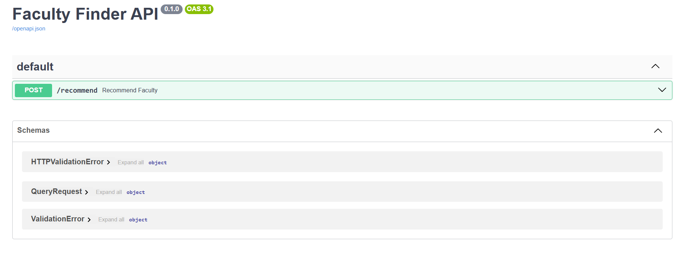
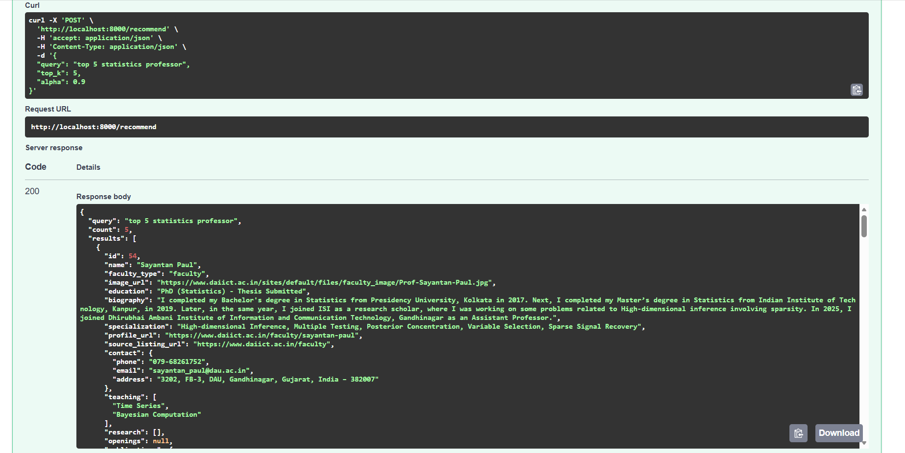
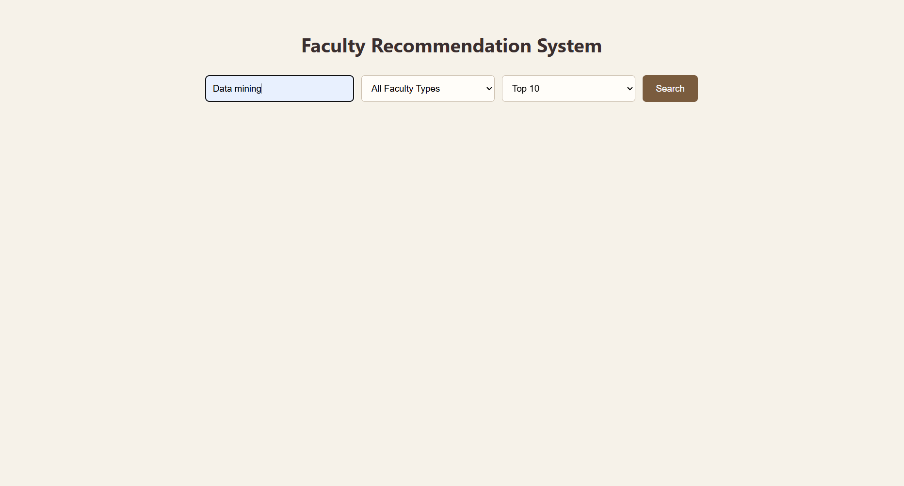
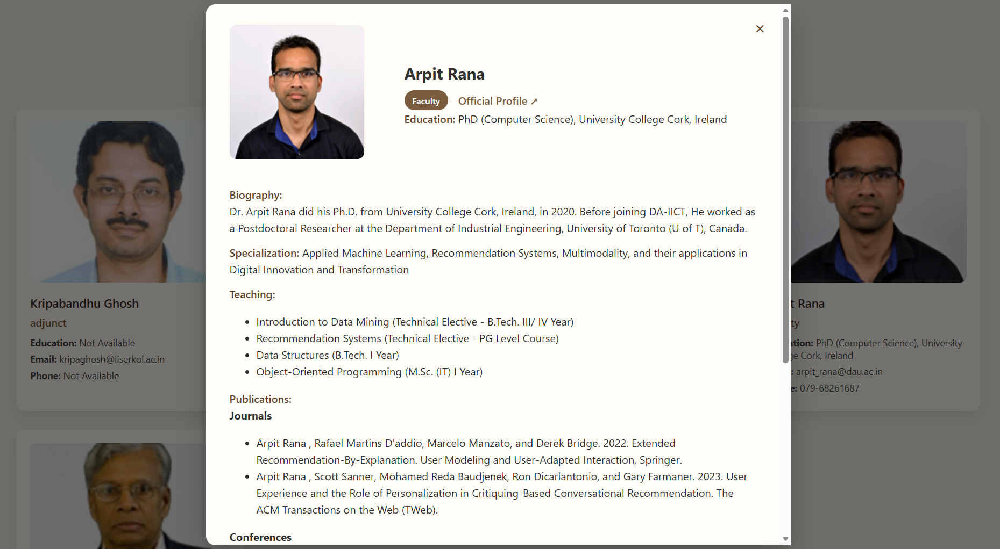

# Faculty Recommendation System

[](https://deploy-production-c068.up.railway.app/)


## Project Summary:

This project implements a Faculty Recommendation System built on a modular, end-to-end data engineering pipeline. It begins by crawling and cleaning faculty information from the DAIICT university website, storing it in a structured SQLite database, and preparing it for advanced analytics. The pipeline then powers a semantic search and recommender engine, enabling users to query faculty profiles based on research interests, teaching subjects, publications, and expertise.

---

## Folder Structure

```
Sigma-and-Spark/
│
├── 1. Ingestion/
│   └── scraper.py
│
├── 2. Transformation/
│   └── cleaner.py
│
├── 3. Storage/
│   ├── load_sqlite.py
│   └── faculty.db
│
├── 4. Serving/
│   ├── app.py
│   └── execute_output.py 
│
├── analytics/
│   ├── data_exploration.py
│   └── build_search_corpus.py
│
├── API/
│   ├── recommender_app.py <-- FastAPI Backend
│   └── requirements.txt
│
├── recommender/
│   ├── build_vector_index.py
│   ├── embeddings.py
│   └── search.py
│
├── ui/
│   ├── templates/
│   ├── static/
│   ├── ui.py            
│   └── requirements.txt
│
├── docker/
│   ├── Dockerfile.combined
│   └── docker-compose.yml
│
├── pipeline.py
├── requirements.txt 
├── llm_usage.md
├── screenshots
└── README.md
```

> **LLM Usage**: For a detailed breakdown of which scripts were generated using LLM (ChatGPT) including the key prompts used, please refer to [llm_usage.md](llm_usage.md).

---

## Pipeline Architecture

### 1. Ingestion: (The Scraper)
Crawls faculty listing + profile pages.
Extracts raw data: name, type, bio, education, specialization, teaching subjects, research areas, publications (journals, conferences, others, external links), contact info, profile URL.

**Error Handling:**
* Handles broken links and failed requests
* Skips duplicate faculty profiles
* Continues scraping even if individual profiles fail

---

### 2. Transformation: (The Cleaner)
Clean and normalizes JSON data.
**Rules:**
* Replace missing/invalid fields → "Not Available"
* Standardize contact info
* Ensure lists exist for teaching & publications

---

### 3. Storage: (The Structured Home)
**Database:** `faculty.db` (SQLite).
Stores normalized data in relational tables: `faculty`, `contact`, `teaching`, `research`, `openings`, `publications`.

---

### 4. Serving: (The Hand-off)
REST API endpoint: `http://localhost:8000/faculty`
**Enhanced Serving:**
*   `execute_output.py`: Extracts all data from `faculty.db` and generates a flat `faculty_output.json`.
*   **Purpose**: This JSON is the critical data source for the Recommender System and API.

---

### 5. Analytics & Search Prep
*   **Analytics**: `data_exploration.py` generates statistics (Faculty Type Distribution, Missing Values, Text Lengths).
*   **Search Corpus**: `build_search_corpus.py` processes `faculty_output.json` to create `search_corpus.json`.
    *   It flattens rich text fields (bio, research, publications) into a single "searchable" string for each faculty member.

---

### 6. Recommender System
*   **Build Index**: `build_vector_index.py` reads `search_corpus.json`, computes TF-IDF embeddings, and saves the vector index.
*   **Search Engine**: `search.py` performs cosine similarity search to find relevant faculty based on user queries.

---

### 7. API Layer: (The Brain)
*   **Framework**: FastAPI
*   **File**: `API/recommender_app.py`
*   **Function**: Loads the faculty data and vector index.
*   Exposes the `/recommend` endpoint.
*   **Docs**: Auto-generated Swagger UI at `http://localhost:8000/docs`.

---

### 8. User Interface: (The Face)
*   **Framework**: Flask
*   **File**: `ui/ui.py`
*   **Function**: A clean web interface where users can search for faculty. It communicates with the API to fetch results.

---

### 9. Dockerization
*   **Containerization**: We use a combined Dockerfile (`docker/Dockerfile.combined`) to package both the API and UI.
*   **Orchestration**: `docker/docker-compose.yml` orchestrates the services, networking, and volume mounts.

---

## How to Run the Pipeline (Step-by-Step)

### Prerequisites
*   Python 3.9+
*   Git
*   Docker
  
### 1. Clone & Install
```bash
git clone https://github.com/<username>/Sigma-and-Spark.git
cd Sigma-and-Spark
pip install -r requirements.txt
```

### 2. Run Full Pipeline 
```bash
python full_pipeline.py
```

### 3. Run Analytics (Optional)
```bash
python analytics/data_exploration.py

```

---

## 4. Run with Docker [Ensure Docker Desktop is running in background]

```bash
docker-compose -f docker/docker-compose.yml up --build
```
*   **API**: `http://localhost:8000/docs`
---
## 5. Deployed APP

---
*  https://deploy-production-c068.up.railway.app/

---

## Screenshots

### 1. API Documentation (Swagger UI)


### 2. API Response Example


### 3. UI Input


### 4. UI Output


### 5. UI View



## Credits
Built by **Sigma & Spark**: where B.Sc. Statistics meets Leveled Sparks 

**Srishti Lamba**: 202518003 
*Catching quirks which others miss*

**Nikita Sharma**: 202518038
*If disciplining data was a task*
